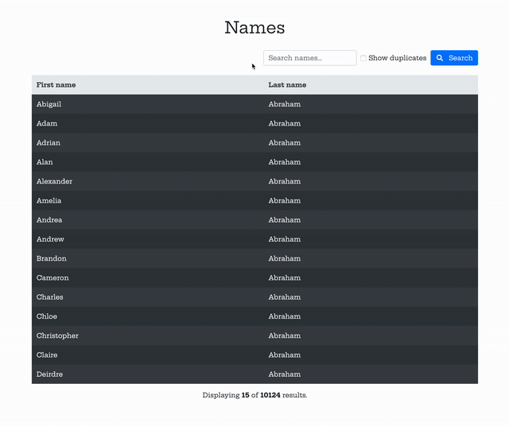

# Names Task

## Installation
- `git clone https://github.com/davidsneal/names-task david-names-task && cd david-names-task/src`
- `composer install`
- `cp .env.example .env && php artisan key:generate`
- Create a database and update the `.env` MySQL credentials as required
- `php artisan migrate --seed`
- `php artisan serve`
